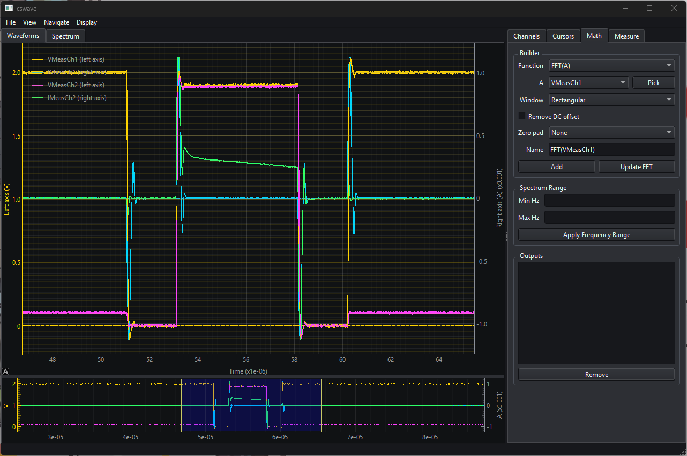
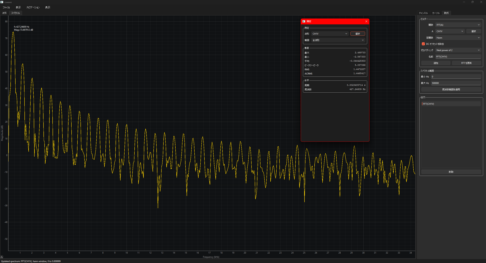
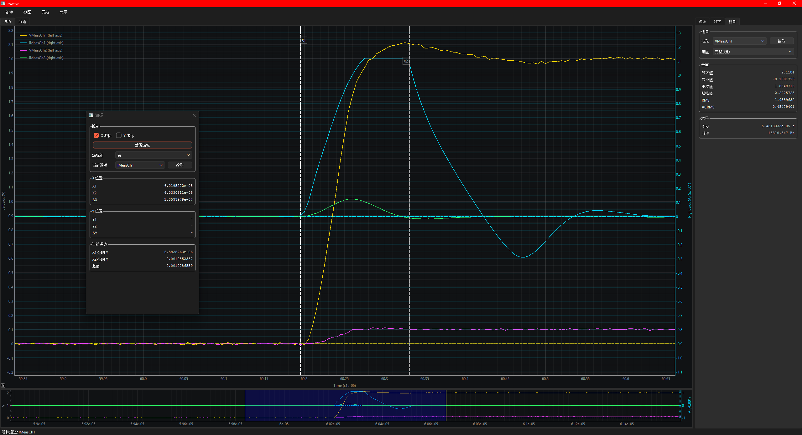
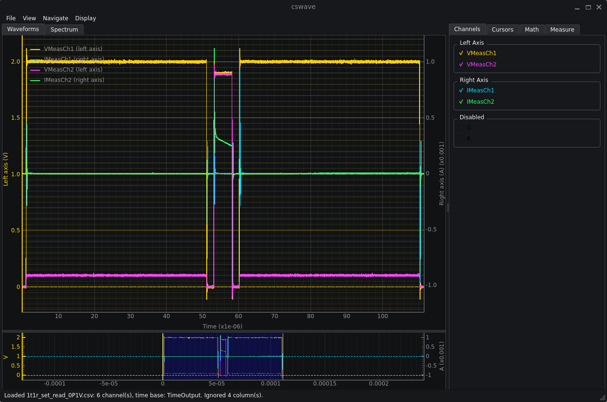

# CSV Waveform Viewer

[English](README.md) | [中文](README.zh_CN.md)

CSV Waveform Viewer は、CSV と Excel の波形ファイルを表示する Python デスクトップアプリです。PySide6 と pyqtgraph で構築されています。このアプリは最近の macOS、Ubuntu、Windows でテストされています。未発見の不具合が残っている可能性があるため、問題があれば GitHub に issue を作成してください。

リポジトリ：<https://github.com/Chutian-Wang/cswave.git>

## 開発環境のセットアップ

```bash
python -m venv .venv
source .venv/bin/activate
pip install -r requirements.txt
```

## ソースから実行

```bash
python main.py example_csv/1t1r_set_read_0P1V.csv
```

アプリは CSV と Excel の波形ファイルを読み込み、`TimeOutput` のような時間列を検出し、大部分が無効なチャンネルを除外して、有効なチャンネルをオシロスコープ風の色で描画します。チャンネルのチェックボックスで表示するトレースを制御し、マウスホイールとドラッグで移動やズームを行い、下部のプレビュー領域で時間範囲を選択し、Cursors タブで可動の X/Y カーソルを有効にできます。

## デモ

| 波形ビューア | FFT スペクトル |
| --- | --- |
|  |  |

| ローカライズと分離パネル | Ubuntu/システム外観 |
| --- | --- |
|  |  |

## ダウンロードして実行

パッケージ版は、Python をインストールしたくないユーザー向けです。

| プラットフォーム | 実行方法 |
| --- | --- |
| Windows | `cswave-<version>-windows-x64.zip` をダウンロードして展開し、`cswave.exe` を実行します。 |
| macOS | `cswave-<version>-macos.zip` をダウンロードして展開し、`CSV Waveform Viewer.app` を開きます。初回起動時に macOS がブロックする場合は、Finder のコンテキストメニューから「開く」を選択してください。 |
| Linux | `cswave-<version>-linux-x64.tar.gz` をダウンロードして展開し、`cswave/cswave` を実行します。 |

ファイルは `File` > `Open Waveform` から開けるため、コマンドライン操作は必須ではありません。

## 主な機能

- CSV/XLS/XLSX の読み込み、自動時間ベース検出、数値チャンネルのフィルタリング。
- 複数シートを持つ Excel ファイルのシート選択。
- オシロスコープ風の表示。
- 左右独立した Y 範囲を持つ二重 Y 軸。
- 自動デフォルトグループ：
  - 電圧チャンネル（`V`）は左軸
  - 電流チャンネル（`A`）は右軸
  - V/I 以外のチャンネルはデフォルトで無効
- Waveform Setup ダイアログで時間ベースの選択/上書きと、波形の左軸・右軸・無効グループへの割り当てが可能。
- Channels タブで有効な波形の表示/非表示を切り替え、チャンネルを左軸、右軸、無効グループへドラッグできます。
- 波形を開く、活動 Y 軸グループ、ズーム、レンダラー、外観、言語を制御するネイティブメニュー。
- メイン波形プロットで X のパン/ズームと活動 Y 軸のパン/ズーム。
- 波形をクリックするとその波形をハイライトし、他のトレースを薄く表示し、その波形の軸グループへ切り替えます。
- ハイライト波形モードでは、活動トレースグループの自由な X/Y パンが可能。
- プレビューウィンドウはメインプロットと同じ左右 Y スケールを使用。
- プレビューのハイライト領域を離すとメイン X 範囲を制御。
- プレビュー上のマウスホイールで、ハイライト領域の見た目の幅を保ちながら時間スケールをズーム。
- オプションの OpenGL レンダラー。Display メニューから選択でき、起動前に `CSWAVE_OPENGL=1` を設定することもできます。
- プロット上ラベル付きの可動 X/Y カーソル、位置、差分、活動チャンネル補間値。
- カーソルラベルを直接ドラッグして移動可能。
- カーソル軸グループ選択器は、活動チャンネル候補をカーソルグループでフィルタリング。
- X 位置、Y 位置、活動チャンネル値をグループ化したカーソル読み取り。
- Reset Cursors ボタン/ショートカットで、カーソルを活動 Y グループと現在画面中央へ移動。
- Math タブで計算トレースと FFT スペクトル解析。

## ショートカットと操作

| 操作 | コントロール |
| --- | --- |
| 波形を開く | `Ctrl+O` / `Cmd+O` または `File` > `Open Waveform` |
| 活動 Y 制御グループを切り替え | `T` |
| 活動 Y 制御グループを選択 | `Navigate` > `Y group` |
| X をパン | メインプロット上でドラッグ |
| 活動 Y 軸をパン | `Ctrl` + メインプロット上でドラッグ |
| ハイライトトレースを自由パン | 波形をクリックしてからメインプロット上でドラッグ |
| X をズーム | メインプロット上でマウスホイール |
| 活動 Y 軸をズーム | `Ctrl` + マウスホイール |
| プレビュー時間ズーム | プレビューバー上でマウスホイール |
| プレビュー範囲選択 | プレビューのハイライト領域をドラッグ/リリース |
| 波形をハイライト | 表示中の波形を左クリック |
| ハイライト解除 | プロットの空白部分を左クリック |
| メニューズーム | `Navigate` > `Zoom` > `X` または `Y` を選び、`Zoom In` / `Zoom Out` を使用 |
| ビューをリセット | `Ctrl+R` / `Cmd+R` または `View` > `Reset View` |
| 波形設定 | `View` > `Waveform Setup...` |
| レンダラー選択 | `Display` > `Renderer` (`CPU` / `OpenGL`) |
| X カーソル切り替え | `X` または `X cursors` チェックボックス |
| Y カーソル切り替え | `Y` または `Y cursors` チェックボックス |
| カーソル移動 | 破線カーソルまたはそのラベルをドラッグ |
| カーソルをリセット | `Shift+R` または Cursors タブの `Reset Cursors` ボタン |

Navigate のズーム制御で `Y` が選ばれている場合、ズームコマンドは現在の活動 Y 制御グループに適用されます。`T` または `Y group` メニューで、活動グループを左軸と右軸の間で切り替えられます。カーソル軸グループは Cursors タブで独立して制御されるため、活動 Y 制御を切り替えても既存カーソルは移動しません。

## Waveform Setup

Waveform Setup は波形ファイルの読み込み後に開き、View メニューからも開けます。X 軸の時間ベースと各波形の Y 軸割り当てを制御します。

時間ベースのオプション：

| モード | 動作 |
| --- | --- |
| `Time column` | 選択した数値列を X 軸として使用します。列は有限値で厳密に増加している必要があります。非均一間隔は警告付きで許可され、FFT は中央値のサンプル間隔を使用します。選択した時間列は信号として描画されません。 |
| `Sample rate (Sa/s)` | `sample_index / sample_rate` として時間を生成します。検出された時間列を含むすべての有効な数値列が通常信号として扱われます。 |
| `Sample interval (s/pt)` | `sample_index * sample_interval` として時間を生成します。検出された時間列を含むすべての有効な数値列が通常信号として扱われます。 |
| `Sample index` | `0, 1, 2, ...` を X 軸として使用します。すべての有効な数値列が通常信号として扱われます。 |

ファイルに検出された時間列がある場合でも、生成された時間ベースで上書きできます。その場合、検出された時間列は通常信号になり、他の波形と同じように軸へ割り当てたり無効化したりできます。

波形テーブルでは、各信号を左軸、右軸、無効状態へ割り当て、軸単位と初期 Y 範囲を編集できます。

## Math

Math タブは、読み込まれた波形からセッション限定の計算出力を作成します。新しい波形ファイルを読み込むと、計算トレースとスペクトルは消去されます。

### 時間領域トレース

関数を選び、操作数 `A` を選択し、二項関数の場合は操作数 `B` も選びます。その後、生成された出力名を受け入れるか入力して `Add` を押します。操作数の横にある `Pick` を押してからメインプロット上の波形をクリックすると、その操作数を指定できます。時間領域の結果は通常の波形トレースとして追加されるため、チャンネルリスト、凡例、プレビュー、軸設定、トレースハイライト、カーソル読み取りに表示されます。

対応する時間領域関数：

| 種類 | 関数 |
| --- | --- |
| 単項 | `A^2`, `sqrt(A)`, `abs(A)`, `log10(A)`, `ln(A)`, `-A` |
| 二項 | `A+B`, `A-B`, `A*B`, `A/B` |

ゼロ除算や負数の平方根などの無効な数値結果は、非有限サンプルとして残され、プロットではスキップされます。

### FFT スペクトル

`FFT(A)` を選択すると、波形 `A` から周波数領域スペクトルを作成します。スペクトルは `Spectrum` ビューで開き、元波形の色を使い、Hz に対する dB 振幅として表示されます。

FFT コントロール：

| コントロール | 動作 |
| --- | --- |
| `Window` | FFT 前に `Rectangular`、`Hann`、`Hamming`、`Cosine` 窓を適用します。 |
| `Remove DC offset` | DC ビンが Y 範囲を支配しないよう、窓処理前に選択区間の平均を差し引きます。 |
| `Zero pad` | 選択区間の後ろにゼロを追加して、FFT ビンをより細かくします。選択肢は `None`、`Next power of 2`、`2x`、`4x`、`8x` です。これは表示/補間密度を改善しますが、真の周波数分解能は向上しません。 |
| `Add` | 指定名の FFT スペクトルを作成または置き換えます。 |
| `Update FFT` | 現在の X カーソル範囲、窓、DC、ゼロパディング設定で選択スペクトルを再計算します。 |
| `Min Hz` / `Max Hz` | FFT を再計算せずに表示周波数範囲をフィルタリングします。 |

FFT の時間範囲：

- X カーソルが非表示の場合、FFT は有限な波形時間範囲全体を使用します。
- X カーソルが表示されている場合、FFT は `X1` と `X2` のソート済み区間を使用します。
- X カーソルを動かしてもスペクトルは自動再計算されません。`Update FFT` を押してください。

スペクトルビュー：

- マウスホイールで周波数をズーム。
- `Ctrl`/`Cmd` + マウスホイールで振幅をズーム。
- ドラッグで周波数をパン。
- `Ctrl`/`Cmd` + ドラッグで振幅をパン。
- 周波数は表示スペクトル範囲に制限されます。
- スペクトルピーク付近にホバーすると、周波数と dB 振幅が表示されます。

Math 出力リストの項目をクリックすると、対応するビューへ切り替わります。計算波形出力は `Waveforms` に切り替えてトレースをハイライトし、FFT 出力は `Spectrum` に切り替えます。

## ローカライズ

GUI は Qt ネイティブの翻訳機能を使用します。英語がソース言語およびフォールバック言語です。

一致するコンパイル済み翻訳がある場合、デフォルトでは OS の言語を使用します。起動時に明示的なロケールを指定することもできます。

```bash
python main.py --language ja_JP example_csv/1t1r_set_read_0P1V.csv
```

システム言語を明示的に使用するには `--language system` を指定します。

`Display` メニューには `Language` セレクターもあります。別の言語を選択すると再起動を確認し、選択した起動ロケールでアプリを再起動します。

翻訳ファイルは `translations/` にあります。

- `cswave_en.ts` は英語の参照カタログです。
- `cswave_zh_CN.ts` / `.qm` と `cswave_ja_JP.ts` / `.qm` は中国語と日本語の翻訳です。
- 翻訳者は追加の `cswave_<locale>.ts` ファイルを作成できます。
- 実行時に使うコンパイル済みファイル名は `cswave_<locale>.qm` です。

一般的な翻訳ワークフロー：

```bash
pyside6-lupdate main.py viewer.py plot_widgets.py -ts translations/cswave_en.ts
pyside6-lupdate main.py viewer.py plot_widgets.py -ts translations/cswave_ja_JP.ts
pyside6-lrelease translations/cswave_ja_JP.ts -qm translations/cswave_ja_JP.qm
```

## リリースビルド

リリースビルドは PyInstaller を使用し、翻訳、サンプル、README、ライセンスファイルを含みます。ビルド成果物は `release/` に書き込まれます。

Windows：

```powershell
.\scripts\build_windows.ps1
```

macOS：

```bash
./scripts/build_macos.sh
```

Linux：

```bash
./scripts/build_linux.sh
```

macOS/Linux では `SKIP_TESTS=1` を設定し、Windows では `-SkipTests` を渡すと、パッケージング中のテスト実行をスキップできます。

## ライセンス

CSV Waveform Viewer は MIT License で公開されています。詳細は [LICENSE](LICENSE) を参照してください。
